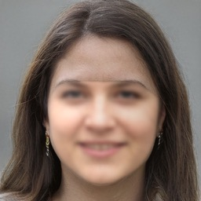

# Face-Synthesis

This project locates different faces in multiple images, warps them to a certain perspective so that the facial landmarks / corresponding areas are matched. Then the average of the morphed faces is computed and blended back to the reference plane with the help of poisson editing.

> *Outside reference resources and libraries:*

- [face_recognition][1] library (built based on dlib)

- [Face Morph Using OpenCV][2] by Satya Mallick

- [this person doesn't exist dot com][3] (generating artificial faces)

[1]: https://github.com/ageitgey/face_recognition "face_recognition"
[2]: https://www.learnopencv.com/face-morph-using-opencv-cpp-python 
[3]: https://thispersondoesnotexist.com/